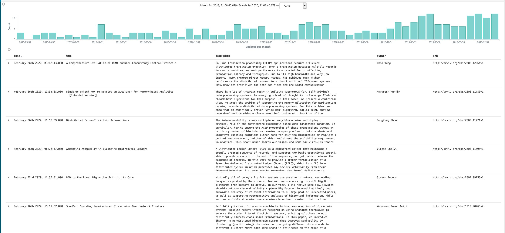

# Arxibana

This project is inspired by [arxivSanity preserver project](https://github.com/karpathy/arxiv-sanity-preserver) by A. Karpathy. However, there are some key differences:
- the arxiv scraper is written in Go instead of Python
- its not a full web app; instead using Kibana dashboard as the UI and elasticsearch for backend storage

## Overview

The go script `arxivProcessing.go` downloads arxiv paper data every 24 hours and stores it in an elasticsearch index, which is used for the Kibana dashboard.

By default, the go script is configured to download 10 latest papers for the categories: Databases(cs.DB) and Distributed computing (cs.DS). At the start, it downloads 500 recent ones and then switches to 24 hours cadence.
It won't add paper if that paper is already added.

Here's my dashboard

## How to use it
- For macOS

        wget https://github.com/vksah32/arXibana/archive/v1.0.tar.gz
        tar -xvzf v1.0.tar.gz
        cd arXibana-1.0
        docker-compose up -d

- For raspberry pi (arm cpu)

        wget https://github.com/vksah32/arXibana/archive/v2.0.tar.gz
        tar -xvzf v2.0.tar.gz
        cd arXibana-2.0
        docker-compose up -d

- Modify Dockerfile if you want to change the arxiv search categories

## Setting up Kibana dashboard

- Go to [localhost:5601](http://localhost:5601)
- There should be " Data already in Elasticsearch? Set up index patterns"; click on it.
- Type db* (should autopopulate) and click next step (if it asks you to pick a time column, choose `Published` or `Updated`). 
- CLick on `Discover` tab (should be on the left hand side)
- It might appear empty because of the time range filter. In teh upper right corner there should be time filter and make it like last 5 years ( for more, can use absolute time filter)
- you should then see some data, click on the columns that you want to see displayed, and there you go!
- You can also explore more kibana functionalities and add more Visualizations dashboard.